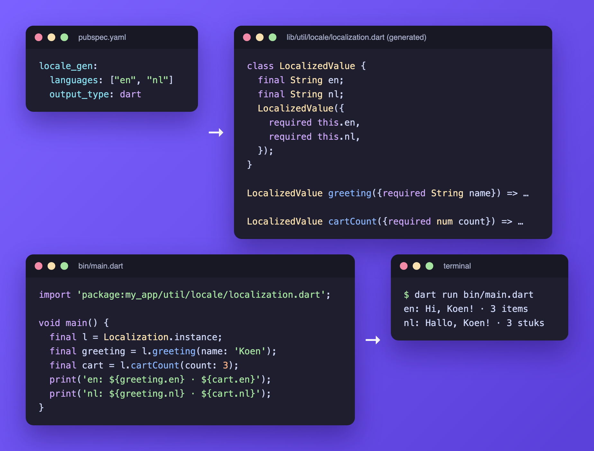

# Dart writer

`output_type: dart` generates code for projects without Flutter: command-line tools, servers, and packages shared between an app and a backend. Every translation of every language is compiled into a single `localization.dart`, so nothing is loaded at runtime and there is no asset to ship.



## Setup

```yaml
dependencies:
  intl: ^0.20.2
  sprintf: ^7.0.0

dev_dependencies:
  locale_gen: ^12.6.0 # x-release-please-version

locale_gen:
  languages: ["en", "nl", "zh-Hans-CN"]
  output_type: dart
```

```shell
dart run locale_gen
```

`assets_path` is not used, because nothing is loaded at runtime. `locale_assets_path` still tells the generator where the JSON files are.

## Using translations

Every key returns a `LocalizedValue` with one `String` field per language:

```dart
import 'package:my_app/util/locale/localization.dart';

void main() {
  final localization = Localization.instance;

  final greeting = localization.greeting(name: 'Koen');
  print(greeting.en);        // Hi, Koen!
  print(greeting.nl);        // Hallo, Koen!
  print(greeting.zhHansCN);  // 你好, Koen!
}
```

The field name is the language tag without dashes: `en` → `en`, `fi-FI` → `fiFI`, `zh-Hans-CN` → `zhHansCN`.

`LocalizedValue` gives you every language at once, which fits the typical non-Flutter use cases: storing all languages of a notification, or answering an API request in the language of its `Accept-Language` header.

```dart
String inLanguage(LocalizedValue value, String languageTag) => switch (languageTag) {
      'nl' => value.nl,
      'zh-Hans-CN' => value.zhHansCN,
      _ => value.en,
    };
```

## Formatting dates and times

Outside Flutter, `intl` has no date symbols loaded, not even for `en`, and throws `LocaleDataException` when a translation formats a `date` or `time`. Initialize it once, before reading those translations:

```dart
import 'package:intl/date_symbol_data_local.dart';

Future<void> main() async {
  await initializeDateFormatting();
  print(Localization.instance.placedAt(placedAt: DateTime.now()).nl);
}
```

Numbers, currencies and durations do not need this.

## Differences from the Flutter writer

- **Every key must exist in every language.** Generation fails with `Key <key> not found in locale <language>` instead of falling back at runtime.
- **No JSON-object plurals.** Generation fails with `Plurals are not supported for dart writer`. Use an [ICU plural](translation-formats.md#plural), which the Dart writer supports.
- **No runtime overrides, locale filter or show keys**, since nothing is loaded at runtime.
- **Values are fixed at generation time.** Regenerate after changing a JSON file.

See [`example_dart`](../example_dart) for a program that prints every translation format in every language.
