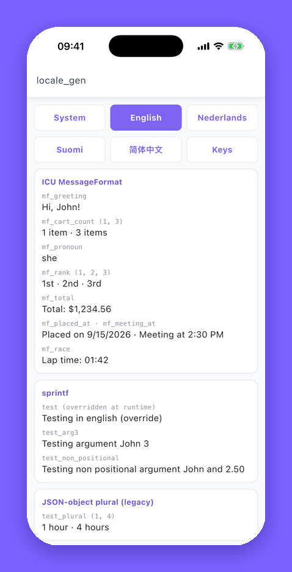

# Flutter writer

`output_type: flutter` is the default. It generates code that loads `<assets_path><language>.json` from your asset bundle at runtime and exposes it through Flutter's `Localizations`.



## Setup

```yaml
dependencies:
  flutter_localizations:
    sdk: flutter
  intl: ^0.20.2
  sprintf: ^7.0.0

dev_dependencies:
  locale_gen: ^12.6.0 # x-release-please-version

flutter:
  assets:
    - assets/locale/

locale_gen:
  languages: ["en", "nl"]
```

```shell
dart run locale_gen
```

## Generated files

All in `output_path` (default `lib/util/locale/`):

| File                          | Contains |
| ----------------------------- | -------- |
| `localization.dart`           | `Localization`, with a getter or function per key, plus `getTranslation` |
| `localization_keys.dart`      | `LocalizationKeys`, a `static const` with the raw JSON key for every translation |
| `localization_delegate.dart`  | `LocalizationDelegate`, the `LocalizationsDelegate<Localization>` you give to your app |
| `localization_overrides.dart` | `LocalizationOverrides`, the interface for [runtime overrides](#runtime-overrides) |

## Registering the delegate

```dart
MaterialApp(
  localizationsDelegates: [
    LocalizationDelegate(),
    GlobalMaterialLocalizations.delegate,
    GlobalWidgetsLocalizations.delegate,
    GlobalCupertinoLocalizations.delegate,
  ],
  supportedLocales: LocalizationDelegate.supportedLocales,
  home: const HomeScreen(),
);
```

Without `newLocale`, Flutter picks the best match for the device language from `supportedLocales`.

`LocalizationDelegate` also exposes:

| Member                                | Description |
| ------------------------------------- | ----------- |
| `LocalizationDelegate.defaultLocale`  | The `default_language` as a `Locale` |
| `LocalizationDelegate.supportedLocales` | Every language as a `Locale`, default language first, after the [locale filter](#filtering-locales-at-runtime) |
| `LocalizationDelegate.supportedLanguages` | The same list as language tags (`'en'`, `'zh-Hans-CN'`) |
| `activeLocale`                        | The locale that was loaded last |

## Using translations

```dart
final localization = Localization.of(context);

Text(localization.settings);                  // plain string
Text(localization.welcomeBack('Koen'));       // sprintf
Text(localization.cartCount(count: 3));       // ICU MessageFormat
```

`Localization.of(context).locale` tells you which locale was loaded.

When a key is missing in the loaded language, you get the key itself back. When a value cannot be formatted (for example the wrong argument type for a sprintf marker), you get `⚠key⚠`. Either way nothing throws while building a widget.

## Switching language at runtime

Keep the delegate in state that rebuilds your app, and replace it with one that has a `newLocale`:

```dart
class LocaleViewModel with ChangeNotifier {
  var localeDelegate = LocalizationDelegate();

  void setLocale(Locale? locale) {
    // null goes back to the device language
    localeDelegate = LocalizationDelegate(newLocale: locale);
    notifyListeners();
  }
}
```

```dart
Consumer<LocaleViewModel>(
  builder: (context, viewModel, child) => MaterialApp(
    localizationsDelegates: [
      viewModel.localeDelegate,
      GlobalMaterialLocalizations.delegate,
      GlobalWidgetsLocalizations.delegate,
      GlobalCupertinoLocalizations.delegate,
    ],
    locale: viewModel.localeDelegate.activeLocale,
    supportedLocales: LocalizationDelegate.supportedLocales,
    home: const HomeScreen(),
  ),
);
```

Persisting the choice is up to you. [`example_flutter`](../example_flutter/lib/viewmodel/locale/locale_viewmodel.dart) stores it in `shared_preferences`.

## Runtime overrides

Overrides replace bundled translations with values you fetch yourself, for example from your backend, so a typo can be fixed without a new release. Extend the generated `LocalizationOverrides`:

```dart
class RemoteLocalizationOverrides extends LocalizationOverrides {
  var _translations = <Locale, Map<String, dynamic>>{};

  @override
  Future<void> refreshOverrideLocalizations() async {
    _translations = await api.fetchTranslations();
  }

  @override
  Future<Map<String, dynamic>> getOverriddenLocalizations(Locale locale) async {
    return _translations[locale] ?? {};
  }
}
```

```dart
final overrides = RemoteLocalizationOverrides();
await overrides.refreshOverrideLocalizations();
localeDelegate = LocalizationDelegate(localizationOverrides: overrides);
```

An override value wins over the bundled one for the same key and uses the same format. locale_gen does not refresh or cache overrides for you: call `refreshOverrideLocalizations` when you want new values, then replace the delegate so Flutter loads them. In the recording at the top of the README, `test` is overridden this way.

## Filtering locales at runtime

Ship a language to your beta testers before everyone else:

```dart
LocalizationDelegate.localeFilter = (languageTag) {
  if (languageTag == 'fi-FI') return isBetaBuild;
  return true;
};
```

Set it before your app builds. `supportedLocales`, `supportedLanguages` and `isSupported` all respect it.

## Show keys

`showLocalizationKeys: true` makes every translation return its key. Translators and QA use it to find which key is on screen, and the example app has a "Keys" button for it:

```dart
localeDelegate = LocalizationDelegate(showLocalizationKeys: true);
```

## Caching

`LocalizationDelegate(useCaching: ...)` controls whether the JSON asset is cached by the `AssetBundle`. It defaults to `!kDebugMode`, so a hot restart picks up edited JSON during development.

## Loading without a delegate

`Localization.load` is what the delegate calls. Call it yourself when you need a `Localization` outside the widget tree, or from another `AssetBundle`:

```dart
final localization = await Localization.load(
  locale: const Locale('nl'),
  bundle: myAssetBundle,          // defaults to rootBundle
  localizationOverrides: overrides,
  showLocalizationKeys: false,
  useCaching: true,
);
```

## Testing

Show keys makes widget tests independent of the copy. Pair it with `LocalizationKeys`:

```dart
await tester.pumpWidget(
  MaterialApp(
    localizationsDelegates: [LocalizationDelegate(showLocalizationKeys: true)],
    home: const HomeScreen(),
  ),
);

expect(find.text(LocalizationKeys.greeting), findsOneWidget);
```

## Dynamic keys

For a key that is only known at runtime:

```dart
localization.getTranslation('welcome_back', args: ['Koen']);
```

`getTranslation` only formats sprintf. For an ICU MessageFormat key it returns the raw template, so use the generated function for those.
