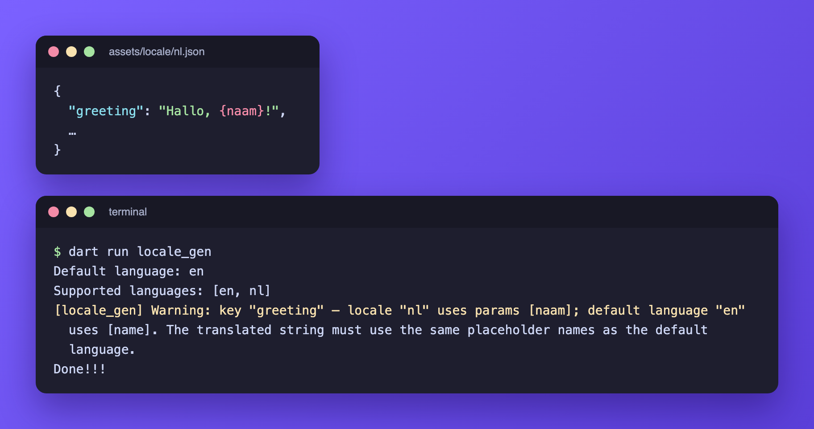

# Translation formats

Every value in a JSON file is one of:

| Format                                    | Looks like                                         | Generates (Flutter writer)                    |
| ----------------------------------------- | -------------------------------------------------- | --------------------------------------------- |
| [Plain string](#plain-strings)            | `"Settings"`                                       | `String get settings`                         |
| [sprintf](#sprintf-arguments)             | `"Hi %1$s"`                                        | `String hi(String arg1)`                      |
| [ICU MessageFormat](#icu-messageformat)   | `"Hi, {name}!"`                                    | `String hi({required String name})`           |
| [JSON-object plural](deprecation/json-object-plurals.md) (legacy) | `{"one": "%d hour", "other": "%d hours"}` | `String hours(num count, int arg1)` |

The Dart writer generates the same signatures, returning [`LocalizedValue`](dart-writer.md) instead of `String`.

## How the format is detected

Detection runs per key, on the value in the **default language**, so one project can mix every format.

1. A JSON object is a legacy plural.
2. A string containing `%s`, `%d`, `%f` or a positional form such as `%1$s` is sprintf.
3. A string containing `{` followed by a letter or `_`, an escaped brace (`'{'` or `'}'`), or two single quotes `''` is ICU MessageFormat.
4. Anything else is a plain string.

A string with both sprintf and MessageFormat markers is ambiguous. locale_gen prints a warning and generates a plain getter that returns the raw value. `{` followed by a digit, as in `"Step {1}"`, is not a MessageFormat marker.

## Plain strings

```json
{ "settings": "Settings" }
```

```dart
String get settings;
```

## sprintf arguments

Formatted with the [sprintf](https://pub.dev/packages/sprintf) package, so its format specifiers work, such as `%.2f` for two decimals.

| Marker         | Dart parameter |
| -------------- | -------------- |
| `%s`, `%1$s`   | `String`       |
| `%d`, `%1$d`   | `int`          |
| `%f`, `%1$.2f` | `double`       |

```json
{
  "inbox": "Hi %1$s, you have %2$d messages",
  "balance": "Your balance is %1$.2f"
}
```

```dart
String inbox(String arg1, int arg2);
String balance(double arg1);
```

**Positional** markers (`%1$s`) carry the argument's index, so a translation can reorder them:

```json
// en.json
{ "intro": "I live in %2$s. Did you know that, %1$s?" }
// nl.json
{ "intro": "%1$s, ik woon in %2$s. Wist je dat niet?" }
```

**Non-positional** markers (`%s`) take the arguments in order. One string cannot mix both styles, and one index cannot be used with two different types. Both mistakes print the problem and generate a plain getter.

## ICU MessageFormat

[ICU MessageFormat](https://unicode-org.github.io/icu/userguide/format_parse/messages/) is the format most translation tools speak. Placeholders are named, so translators can move them freely, and plurals and selects live inside one string. Every placeholder becomes a required named parameter.

### Placeholder

```json
{ "greeting": "Hi, {name}!" }
```

```dart
String greeting({required String name});
```

### Plural

```json
{ "cart_count": "{count, plural, =0 {Your cart is empty} one {# item} other {# items}}" }
```

```dart
String cartCount({required num count});
```

`#` is replaced by the number. Branches are `zero`, `one`, `two`, `few`, `many` and `other` (required), chosen with the plural rules of the active language, plus exact matches such as `=0`.

### Select

```json
{ "pronoun": "{gender, select, male {he} female {she} other {they}}" }
```

```dart
String pronoun({required String gender});
```

### Selectordinal

```json
{ "rank": "{place, selectordinal, =1 {#st} =2 {#nd} =3 {#rd} other {#th}}" }
```

```dart
String rank({required num place});
```

> **Known limitation.** `intl` 0.20 has no ordinal rules yet, so `selectordinal` selects its branch with the *cardinal* plural rules. In English, `two {#nd}` and `few {#rd}` are never picked and `2` renders as `2th`. Exact matches (`=1`, `=2`, `=3`) work, as above, but they do not cover `21st` or `22nd`.

### Number

| Style                     | Example output (`en`) | Formatted with |
| ------------------------- | --------------------- | -------------- |
| `{n, number}`             | `1,234.56`            | `NumberFormat.decimalPattern` |
| `{n, number, percent}`    | `12%` for `0.12`      | `NumberFormat.percentPattern` |
| `{n, number, currency}`   | `$1,234.56`           | `NumberFormat.simpleCurrency` |
| `{n, number, #,##0.0}`    | `1,234.6`             | `NumberFormat` with that pattern |

Parameter type: `num`. The currency symbol comes from the **locale**, not from your data: the same amount shows as `$1,234.56` in `en` and `€ 1.234,56` in `nl`. For prices in one fixed currency, format the amount yourself and pass it as a plain `{price}` placeholder.

### Date and time

| Style                          | Example output (`en`)          | Formatted with |
| ------------------------------ | ------------------------------ | -------------- |
| `{d, date}`, `{d, date, short}` | `9/15/2026`                    | `DateFormat.yMd` |
| `{d, date, medium}`            | `Sep 15, 2026`                 | `DateFormat.yMMMd` |
| `{d, date, long}`              | `September 15, 2026`           | `DateFormat.yMMMMd` |
| `{d, date, full}`              | `Tuesday, September 15, 2026`  | `DateFormat.yMMMMEEEEd` |
| `{d, date, dd/MM/yyyy}`        | `15/09/2026`                   | `DateFormat` with that pattern |
| `{t, time}`, `{t, time, short}` | `2:30 PM`                      | `DateFormat.jm` |
| `{t, time, medium}` (`long`, `full`) | `2:30:00 PM`             | `DateFormat.jms` |
| `{t, time, HH:mm}`             | `14:30`                        | `DateFormat` with that pattern |

Parameter type: `DateTime`. With the Dart writer, call `initializeDateFormatting()` first, see the [Dart writer guide](dart-writer.md#formatting-dates-and-times).

### Duration

| Style                          | Example for 1h 2m 3s  |
| ------------------------------ | --------------------- |
| `{d, duration}`, `{d, duration, medium}` | `01:02:03`  |
| `{d, duration, short}`         | `62:03` (total minutes) |
| `{d, duration, long}`          | `1h 2m 3s`            |
| `{d, duration, mm:ss}`         | `02:03`. `H`, `m` and `s` are hours, minutes and seconds, repeat a letter to zero-pad, and wrap literal text in single quotes |

Parameter type: `Duration`. ICU has no `duration` type; this is a locale_gen extension.

### Nesting

Placeholders and formatted values can be used inside plural and select branches:

```json
{ "summary": "{count, plural, one {# order, placed on {placedAt, date, medium}} other {# orders}}" }
```

```dart
String summary({required num count, required DateTime placedAt});
```

A name can be used more than once, also in different formats: `"Placed on {placedAt, date, medium} at {placedAt, time, short}"` generates one `DateTime placedAt` parameter and renders both the date and the time. Every use must need the same Dart type (`{n, number}` and `{n, date}` conflict), and two names must not become the same Dart name (`placed_at` and `placedAt`). Either mistake prints a warning and generates a plain getter.

### Escaping

ICU uses single quotes to escape:

| You want       | Write        |
| -------------- | ------------ |
| `{` or `}`     | `'{'` / `'}'` |
| `'`            | `''`         |

A string with an escape is MessageFormat, so it generates a function without parameters: `"Use '{' to open"` becomes `String useBrace()`.

### Default-locale fallback

When `Localization.locale` is `null`, MessageFormat keys format with `LocalizationDelegate.defaultLocale` instead of failing.

## Warnings

Warnings never stop generation. They are printed with a `[locale_gen] Warning:` prefix.

### Cross-locale validation

For every MessageFormat key, each language is compared against the default language. A translation that renames a placeholder (`{naam}` instead of `{name}`), changes its type (`plural` instead of `select`) or does not parse is reported, because it would not substitute at runtime:



### Strict mode

```yaml
locale_gen:
  message_format_strict: true
```

In a project that uses only MessageFormat, strict mode reports every key that uses sprintf markers and generates it as a plain getter, so a stray `%s` is noticed instead of silently becoming an `arg1` parameter.

## Limitations

- `getTranslation(key, args:)` on the Flutter `Localization` formats sprintf only. A MessageFormat key returns its raw template, so call the generated function instead.
- `selectordinal` uses cardinal rules, see [Selectordinal](#selectordinal).
- A string cannot combine sprintf and MessageFormat markers.
